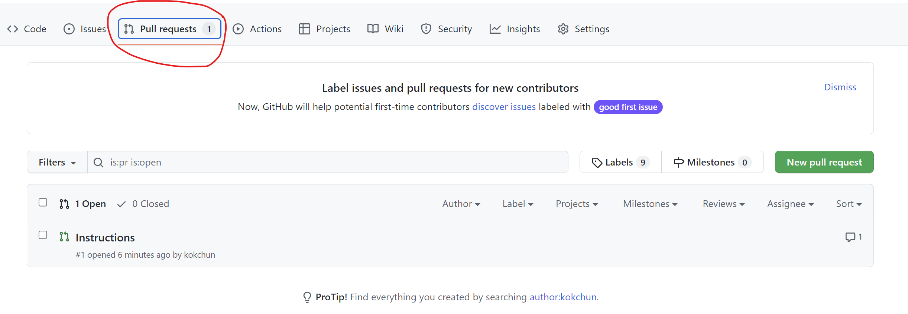

# git-branches


Vi lägger till första raden och commitar

# Added instruction branch

För att checka branches som vi har skriv 

```
git bransh

```

# Pull request

vi öppnar för att få mergea in ändringar från denna branch
gör vi det igenom att skapa ett pull request 



<<<<<<< HEAD
## Merge

efter vaje pull är det viktigt att varje person gör en pull.
=======
# Merging 

Detta ska skapan en konflikt 
>>>>>>> 20b517ebe045b9935923da697391d8c3742c03bf
